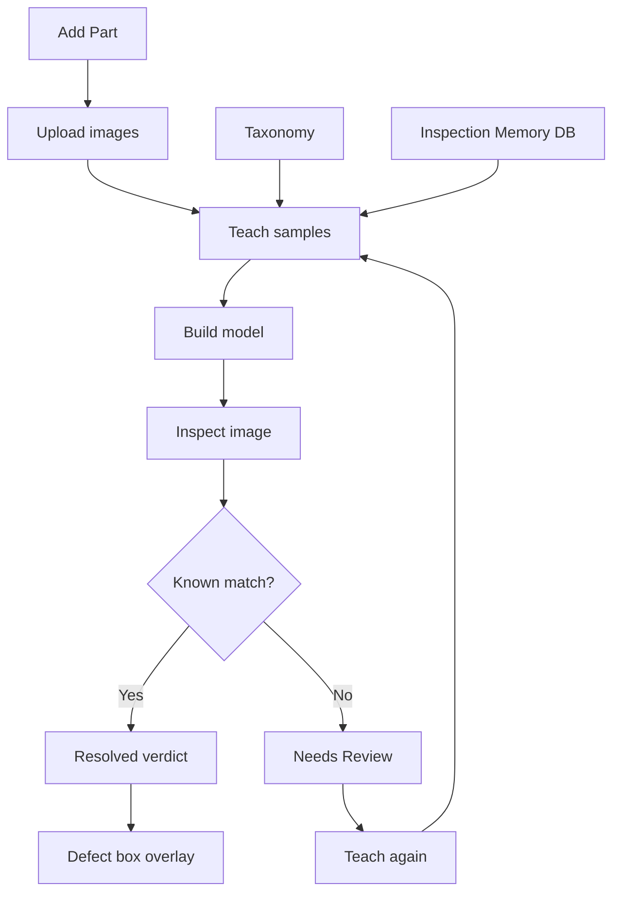

# QMSInspector

Offline, **zero-token** quality-inspection system for manufactured parts
(currently **Bearing Cup** and **Bracket**). It learns from human-marked example
images, packs everything into one portable model file, and then inspects new
images entirely on your machine - **no cloud, no LLM, no API keys**.

Needs Review images (ones the model has never seen) are set aside so a human can
teach them later, closing the loop.

### What this product does

QMSInspector is a local inspection assistant for factory quality teams. It helps
review manufactured parts by comparing incoming images against previously taught
examples, highlighting known defects, and flagging anything unfamiliar for human
review. Instead of sending images to the cloud or depending on a generic object
model, it stays fully on the machine and learns from actual part-specific marks,
defects, and pass/fail decisions from your own quality process.

This is useful when the same parts are inspected repeatedly and the goal is to:

- catch known defects quickly and consistently
- avoid false certainty on unfamiliar images
- keep full control of the inspection process offline
- improve the system over time by teaching it new edge cases

### Terminology

- `Project` - a collection of inspection work for one product or line.
- `Part` - a specific component type being inspected, such as a Bearing Cup or Bracket.
- `Taxonomy` - the list of allowed defect labels or categories for a part.
- `Review` - a human-validated marking that defines what is good or defective on a sample image.
- `Teach` - the process of adding reviewed examples into the local memory so the system can recognize them later.
- `Needs Review` - the safe fallback state when the image does not match any known example confidently.
- `Inspection Memory` - the local SQLite database that stores learned examples and prior inspection history.
- `Model` - the packaged local model built from the learned data for offline inference.

### Workflow diagram



---

## How it works

```
 reviews/<part>.json --teach--> data/inspection_memory.db --build--> models/best.pt
                                                                     |
                                            inspect (0 tokens) <-----+
                                                  |
                                RESOLVED (annotated verdict)  or  Needs Review
                                                                      |
                                             copied to  uncertain/  for teaching
```

* **teach** - reads every `reviews/<part>.json` (each entry = a human marking:
  part, OK/DEFECT, defect boxes/polygons) and stores it as a confirmed example
 (feature vector + perceptual hash) in `data/inspection_memory.db`.
* **build** - packs all examples + geometry + taxonomy + lessons into a single
  `models/best.pt`.
* **inspect** - loads `best.pt` and matches each image by perceptual hash. A match
  replays the confirmed verdict and draws the exact defect masks. No match =>
 `Needs Review`, and the image is copied to `uncertain/` for later teaching.

Inspection never calls any external service.

---

## Install

```powershell
pip install -r requirements.txt
```

## Usage

```powershell
# 1. teach from the review files (idempotent - skips already-learned images)
python qms.py teach

# 2. build the packed model
python qms.py build

# 3. inspect an image or a folder (annotated outputs in inspect_out/)
python qms.py inspect "C:\path\to\image.jpg"
python qms.py inspect "C:\path\to\folder"

#    Needs Review images are copied to ./uncertain by default:
python qms.py inspect "C:\path\to\folder" --uncertain-dir "C:\to_review"
python qms.py inspect "C:\path\to\folder" --no-collect      # don't copy

# summary of what has been learned
python qms.py stats
```

### REST API (also offline)

```powershell
python qms.py serve --port 8000
```

### Startup helper

If you want a one-command reset, use:

```bash
./start.sh
```

That deletes previous `inspection_runs/*` output and starts the server on port `8000`.
To install dependencies first, opt in explicitly:

```bash
./start.sh --install
```

On Windows, use:

```powershell
.\start.bat
```

Or with optional dependency install:

```powershell
.\start.bat --install
```

| Method | Path       | Purpose                                             |
|--------|------------|-----------------------------------------------------|
| GET    | `/health`  | service status + counts                             |
| POST   | `/inspect` | inspect an uploaded image; returns the JSON verdict |
| POST   | `/learn`   | teach a label at runtime (image + label)            |
| GET    | `/parts`   | learned parts + their defect categories             |
| GET    | `/stats`   | counts + recent inspections                         |

---

## Teaching new images

For every image dropped in `uncertain/`, add an entry to the matching
`reviews/<part>.json` (mark OK, or the defect + its box/polygon), then re-run:

```powershell
python qms.py teach
python qms.py build
```

The next inspection of that image (or a near-duplicate) resolves instantly with
zero tokens.

To add a **new part**, create `reviews/<new_part>.json` (same schema) and register
the part + its defects in `knowledge_base/taxonomy.json`. No code changes needed.

---

## Layout

```
qms.py                     single CLI (teach | build | inspect | serve | stats)
inspector/
  settings.py              paths + tunables (env-overridable)
  taxonomy.py              central parts/defects/severity/colors loader
  image_features.py        OpenCV feature extraction + perceptual hash
  knowledge_base.py        SQLite inspection memory + knowledge cache
  renderer.py              draws defect masks / labels / banners
  recognizer.py            offline packed-model recall (the inspect engine)
  model_builder.py         packs everything into models/best.pt
  teacher.py               teaches all parts from reviews/
  live_classifier.py       kNN + rule engine used by the REST API
  live_trainer.py          runtime add/correct used by the REST API
  web_api.py               Flask REST server (offline)
knowledge_base/            taxonomy.json, lessons.json, corrections.json
reviews/                   bearing_cup.json, bracket.json (human markings)
models/best.pt             the packed model
data/inspection_memory.db  durable learned memory
```

### Folder purpose summary

- `data/` - local runtime data, including the main SQLite database
- `data/inspection_memory.db` - durable inspection memory and learned examples
- `reviews/` - human-reviewed sample annotations for each part
- `knowledge_base/` - taxonomy, defect definitions, and training guidance
- `models/` - built inspection model package used for offline inference
- `inspect_out/` - generated annotated inspection outputs
- `uncertain/` - images that did not match confidently and need human review

All inspection is local and free. The only durable state you need to keep is
`data/inspection_memory.db`, `models/best.pt`, `reviews/`, and `knowledge_base/`.
